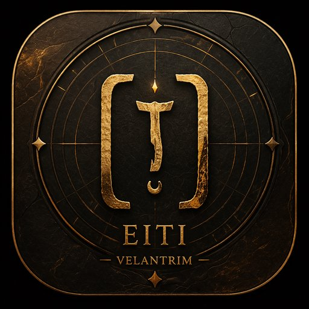

# 🧠 VELANTRIM EITI

Offline-first modular AI system
Knowledge · Memory · Reasoning · Local Intelligence

---

⚡ Overview

VELANTRIM EITI — это локальная (offline-first) система, построенная как экзокортекс мышления.

Она объединяет:

- 🧠 базу знаний (KB)
- 🔤 лемматизацию (язык)
- 🗃 локальную БД (WASM SQLite)
- 🌐 PWA-интерфейс (работает как приложение)
- ⚙️ офлайн-движок без зависимости от API

👉 Система работает без интернета после загрузки.

---

🧾 Version

v12.0 — experimental build
Local-first PWA system with offline engine

---

🧩 Core Components

- 📄 "index.html" — UI + логика системы
- 🔧 "sw.js" — Service Worker (offline + cache)
- 📦 "manifest.json" — PWA конфигурация
- 🧠 "eiti_kb.json" — локальная база знаний (используется для поиска и генерации ответов)
- 🔤 "lemma.json" — словарь нормализации
- 🗄 "sql-wasm.js" + ".wasm" — локальная база данных

---

🚀 Features

- 📡 Offline-first — работает без интернета
- 🧠 Local Knowledge Base — данные хранятся локально
- 🔍 Search + normalization — поиск с учётом форм слов
- ⚡ Fast startup — без серверов и API
- 📱 PWA app — можно установить как приложение
- 🔒 Privacy-first — данные не покидают устройство

---

📱 Install as App

You can install EITI as a PWA:

- Open in Chrome / Edge
- Tap “Add to Home Screen”
- Use as standalone app

Works offline after first load

---

🛠 How to Run

🌐 GitHub Pages

Open in browser:
https://velantrian.github.io/velantrim-eiti/

⚠️ Recommended: use HTTPS (GitHub Pages) for full PWA + Service Worker support

---

💻 Local run

git clone https://github.com/velantrian/velantrim-eiti.git
cd velantrim-eiti

Open "index.html" in browser

⚠️ Note: Service Worker and WASM may not fully work via file:// protocol

---

⚙️ Architecture (Simplified)

User Input
↓
Normalization (lemma.json)
↓
Retrieval (KB + SQLite WASM)
↓
Response (local processing)

Core principle:

- Graph (future) = Truth
- KB = current knowledge layer
- LLM = optional (not required)

---

⚠️ Notes

- ❗ Система находится в стадии развития
- ❗ Некоторые данные требуют очистки (lemma / KB)
- ❗ Архитектура постепенно переходит к Graph-based модели
- ⚠️ This is a local experimental system, not a production AI

---

🧠 Philosophy

VELANTRIM — это не просто AI.

Это:

- 📊 структура мышления
- 🔗 причинно-следственный граф
- 🧭 система ориентации в знаниях

Graph = Truth
KB = Memory
LLM = Voice (optional)

---

📌 Roadmap

- 🔗 Graph Memory integration
- 🧠 Reasoning engine (WHY / HOW / TRACE)
- 🧹 Data cleaning (lemma / KB)
- ⚙️ Modular architecture
- 🛡 Guardian / Truth validation layer

---

👤 Author

Velantrian
Creator of Velantrim system

---

📄 License

MIT (или позже определить)

---

⭐ Project Status

🟡 Active development
🧠 Experimental system
⚙️ Architecture evolving
